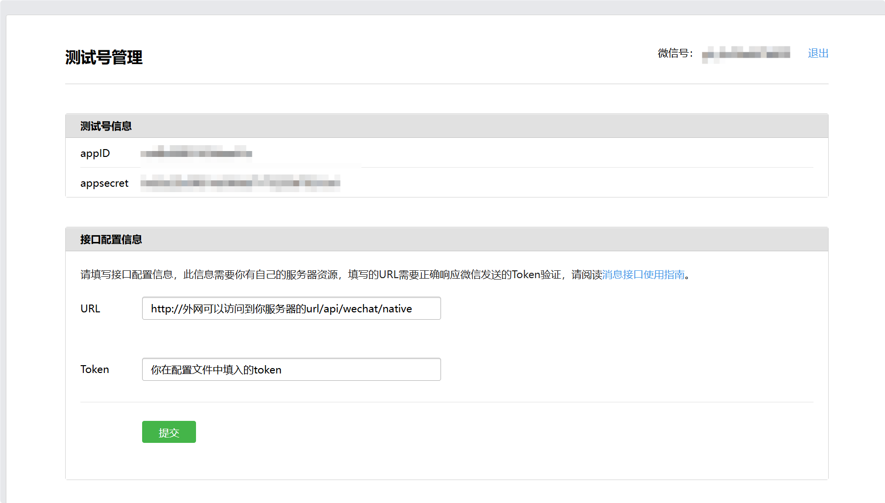
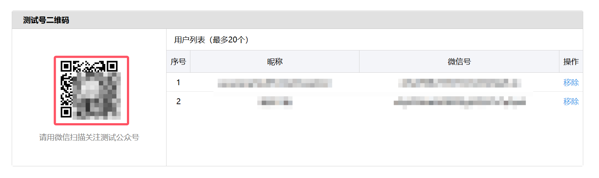
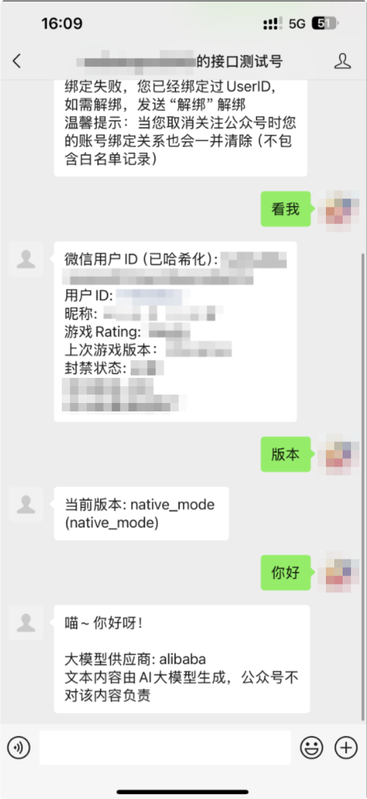

# 配置教程

#### 需要准备：

1. **聪明的脑子和灵活的手**（本文假设您有着较高的电脑使用水平和编程能力，可以独立解决一些简单计算机方面的问题；如果您没有或者对下文涉及到的部分专有名词感到困惑，**请立即关闭此教程**，该教程不适用于您。）
2. 可以全天候工作的电脑或服务器
3. 可以被公网访问的网络（包括但不限于公网IP访问和内网穿透等）
4. 个人微信号和微信测试公众号（[申请链接](https://mp.weixin.qq.com/debug/cgi-bin/sandbox?t=sandbox/login)）

### 第零步：安装python、pip和mysql环境，python版本必须大于等于3.12，mysql版本大于等于8.0

#### 第一步：克隆这个项目到本地，打开项目文件夹，安装相关依赖`pip install -r requirements.txt`

#### 第二步：根据项目目录下的server_config.demo.yaml的注释编辑配置文件并将其另存为server_config.yaml放置在项目目录下

#### 第三步：在项目目录下运行 `python -m maibox` 以运行程序

#### 第四步：在微信测试公众号设置页面下按下图配置，填写完成后点击提交

#### 然后等待微信服务器对URL地址的校验，如果校验成功，在微信测试公众号设置页面内下拉到如图所示的位置，使用你个人微信扫描红框所示的位置关注刚才创建的测试号（校验失败请自行查找问题）

#### 然后可以愉快玩耍了

